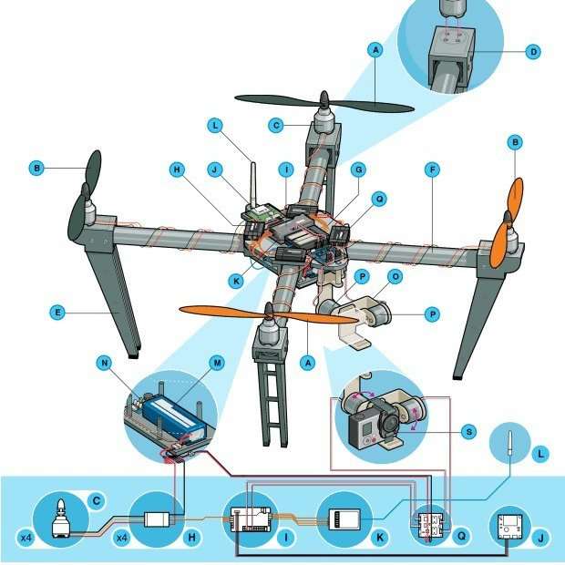
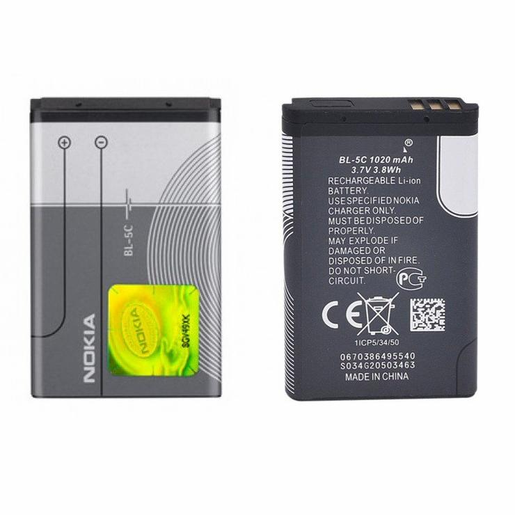
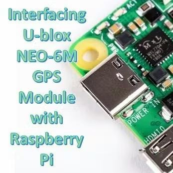
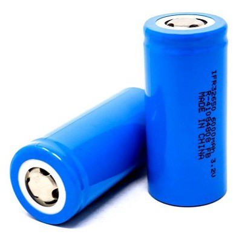
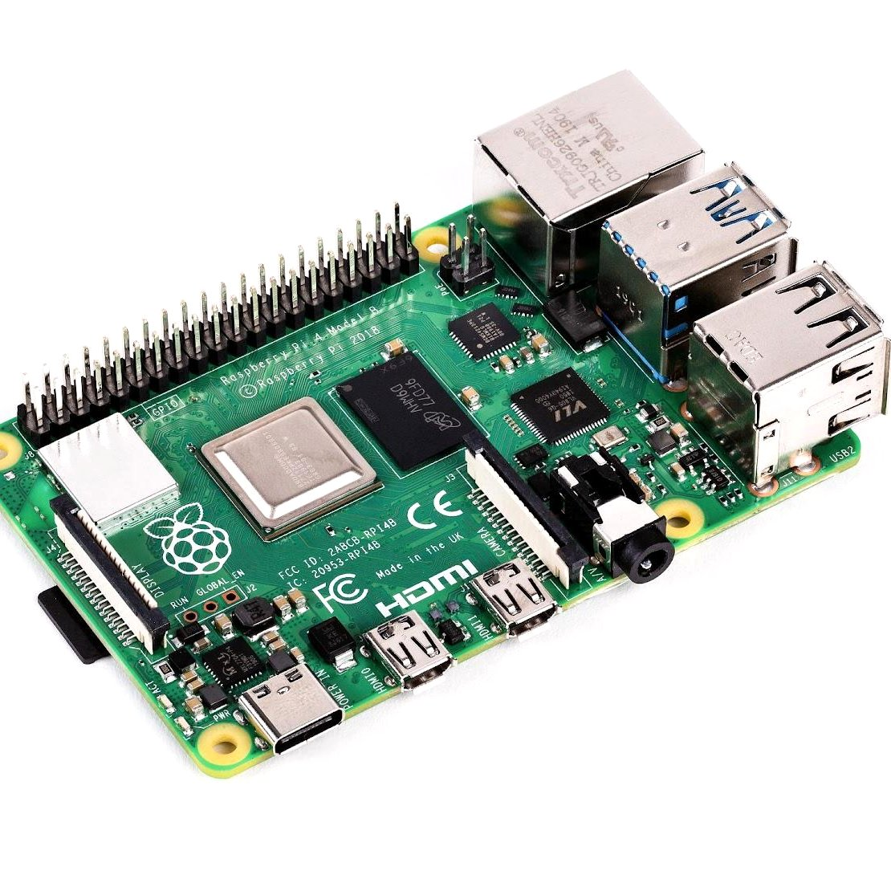
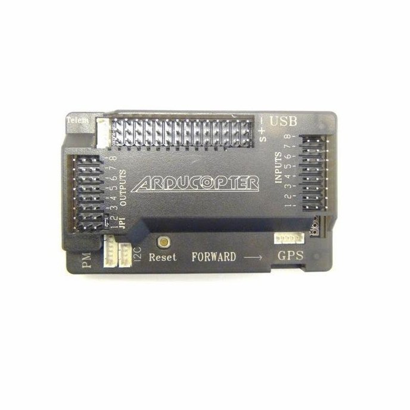
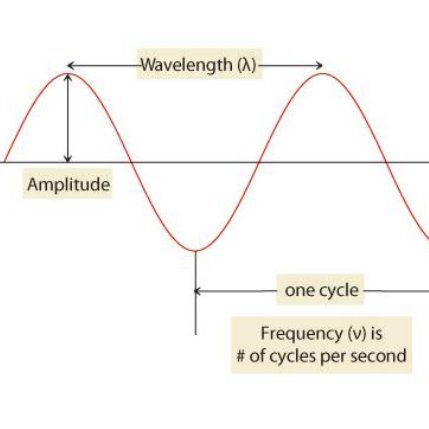

  

    
    <ul style="list-style:none;padding:0;margin-top:0px;">Contact Me:
      <li><a href="mailto:bhushanmapari19@gmail.com">Email</a></li>
      <li><a href="https://in.linkedin.com/in/bhushan-m-b7b572162">LinkedIn</a></li>
    </ul>
  

  
  

    
<strong>Bhushan S. Mapari</strong>

    
<strong>About Me: </strong> Graduate Engineer and Diploma holder specializing in Electronics and Telecommunication Engineering (E&TC). Author of two research papers published in the IEEE Xplore® Digital Library. Experienced professional with over 4 years of corporate experience, including tenure at Wipro and Robu.in. 

     
Certified in emerging technologies, with expertise in technical writing, documentation, AI-assisted content development and hands-on experience with WordPress-based content management. Possess strong verbal and non-verbal communication skills, complemented by proven abilities in research, presentation delivery, problem-solving, teamwork, and cross-functional collaboration. 

  

<h2>Research, Projects, and Publications</h2>

Explore a collection of my research papers, projects, articles, blogs, and publications that showcase my writing style, technical expertise, and ability to communicate complex concepts with clarity and structure for diverse audiences.

 

    
    <h3><a href="https://medium.com/@bhushanmapari24/top-10-online-electronic-components-store-in-india-7c8172ddc082" target="_blank">Top 10 Online Electronic Components’ Stores in India</a></h3>
    
<b>Platform:</b> Medium

  

  

    
    <h3><a href="https://medium.com/@bhushanm_17995/quick-drone-parts-overview-along-with-handy-diy-tips-bdd88f766895" target="_blank">Drone Parts Overview — A Beginner’s Guide</a></h3>
    
<b>Platform:</b> Medium

  

  

    
    <h3><a href="https://medium.com/@bhushanmapari24/lithium-ion-battery-guide-and-tips-for-extending-its-life-f16c08526a9" target="_blank">Lithium-Ion Battery Guide and Tips for Extending its Life</a></h3>
    
<b>Platform:</b> Medium

  

  

    
    <h3><a href="https://www.hackster.io/bhushanmapari/interfacing-u-blox-neo-6m-gps-module-with-raspberry-pi-3d15a5" target="_blank">Interfacing U-blox NEO-6M GPS Module with Raspberry Pi</a></h3>
    
<b>Platform:</b> Hackster

  

    
    <h3><a href="https://robu.in/what-is-arduino-uno/" target="_blank">What is Arduino Uno</a></h3>
    
<b>Platform:</b> Robu Blogs

  

   

    
    <h3><a href="https://hackaday.io/page/7275-difference-between-lithium-ion-lifep04-battery" target="_blank">Difference between Lithium-Ion & LifeP04 Battery</a></h3>
    
<b>Platform:</b> Hackaday

  

  
  

    
    <h3><a href="https://hackaday.io/page/7167-detailed-guide-for-choosing-lipo-battery-for-your-drone" target="_blank">Detailed Guide for Choosing LiPo Battery for Your Drone</a></h3>
    
<b>Platform:</b> Hackaday

  

  

    
    <h3><a href="https://hackaday.io/page/7172-drone-parts-components-overview" target="_blank">Drone Parts & Components' Overview</a></h3>
    
<b>Platform:</b> Hackaday

  

  
  

    
    <h3><a href="https://sites.google.com/view/technophiles/home/articles/introducing-raspberry-pi-4-model-b" target="_blank">Introducing Raspberry Pi 4 Model-B</a></h3>
    
<b>Platform:</b> Technophiles - Google Sites

  

  

    
    <h3><a href="https://sites.google.com/view/technophiles/home/articles/apm-2-8-flight-controller-with-built-in-compass" target="_blank">APM 2.8 Flight Controller with Built-in Compass</a></h3>
    
<b>Platform:</b> Technophiles - Google Sites

  

  

    
    <h3><a href="https://ieeexplore.ieee.org/document/8697892" target="_blank">Simulation and Implementation of Microstrip Patch Antenna for ISM Band</a></h3>
    
<b>Platform:</b> IEEE Xplore® Digital Library

  

  

    
    <h3><a href="https://ieeexplore.ieee.org/document/8697481" target="_blank">Effective Environmental Monitoring & Domestic Home Conditions by Implementation of IoT</a></h3>
    
<b>Platform:</b> IEEE Xplore® Digital Library

  

  

    
    <h3><a href="https://qr.ae/pG0u77" target="_blank">Which Digital Multimeter is Good to Buy? </a></h3>
    
<b>Platform:</b> Quora

  

  

    
    <h3><a href="https://qr.ae/pG0u7N" target="_blank">Where Can I Buy Raspberry Pi Zero in India?</a></h3>
    
<b>Platform:</b> Quora

  

  

    
    <h3><a href="https://github.com/BhushGb/Asciidoc-project" target="_blank">Radio Communication Documentation Project</a></h3>
    
<b>Platform:</b> GitHub

  

  

    
    <h3><a href="https://github.com/BhushGb/P_DITA_XML_Docs/tree/main/calc-user-guide-project" target="_blank">CALC User Guide Project</a></h3>
    
<b>Platform:</b> Github

  

