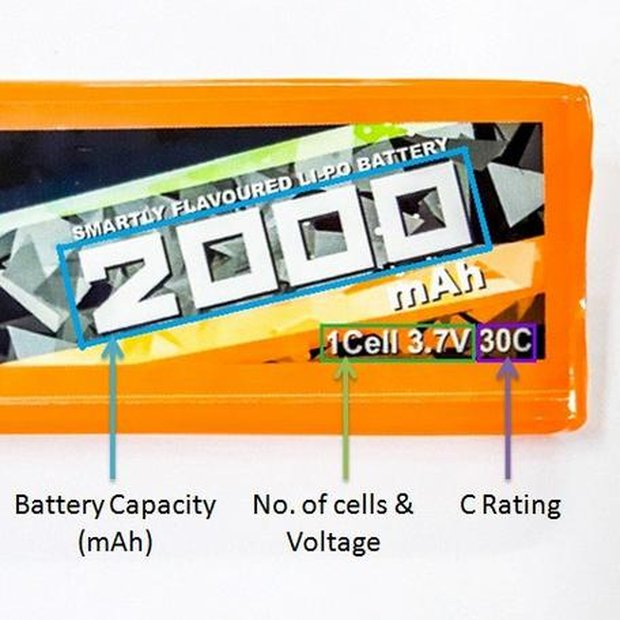

<h1>About Me</h1>

  

 <strong>Bhushan S. Mapari</strong>
 
I'm a Graduate engineer and diploma holder with specialization in Electronics and Telecommunication Engg. (E&TC). Author of 2 research papers published in Institute of Electrical and Electronics Engineers (IEEE) Xplore Library. Multi-tasker with enthusiastic personality, well-versed in English, and certified in various Content Writing courses. 
  

<a href="mailto:yourgmail@gmail.com?subject=Hello&body=Hi there!">
  Send me an email
</a> 

---

## Blogs & Publications

 

  

    
    <h3><a href="https://hackaday.io/page/7178-introduction-to-lithium-ion-battery" target="_blank">Introduction to Lithium Ion Battery</a></h3>
    
A lithium-ion battery or Li-ion battery (abbreviated as LIB) is a type of rechargeable battery. It is a lightweight, high-power battery used in computers and mobile phone.

    
<b>Platform:</b> Hackaday

  

  

    
    <h3><a href="https://blog-link.com" target="_blank">Detailed Blog</a></h3>
    
abcdedf

    
<b>Platform:</b> abcd

  

  

    
    <h3><a href="https://blog-link.com" target="_blank">Detailed Blog</a></h3>
    
abcdedf

    
<b>Platform:</b> abcd

  

  

    
    <h3><a href="https://blog-link.com" target="_blank">Detailed Blog</a></h3>
    
abcdedf

    
<b>Platform:</b> abcd

  

    

    
    <h3><a href="https://blog-link.com" target="_blank">Detailed Blog</a></h3>
    
abcdedf

    
<b>Platform:</b> abcd

  

